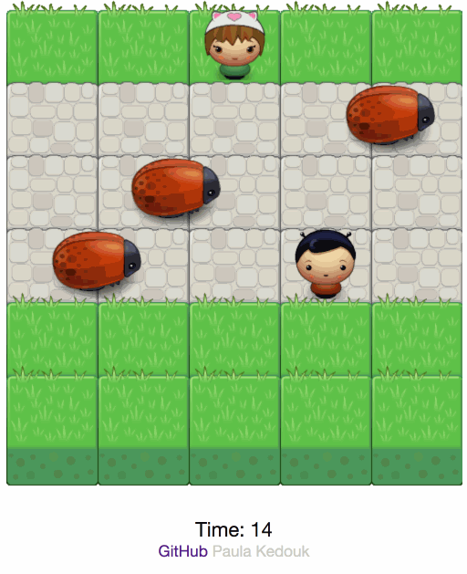

# Classic Arcade Game Clone – “Save your girl!"

## Why This Project?

Games have a lot of objects and those objects do a lot of different things; but sometimes they do some very similar things as well. This creates a great opportunity to practice object-oriented programming, an important programming paradigm that influences your application architecture and provides performance optimization.

## Instructions

Fork, clone, or download a .ZIP copy of the file structure here. Open index.html in a modern HTML5 compliant browser.
You can also click [here](https://paulakedouk.github.io/arcade-game/) to access the site without downloading.

## Controls

Use the arrow keys to move your character.

## Technologies used

* HTML5 canvas
* CSS
* JavaScript